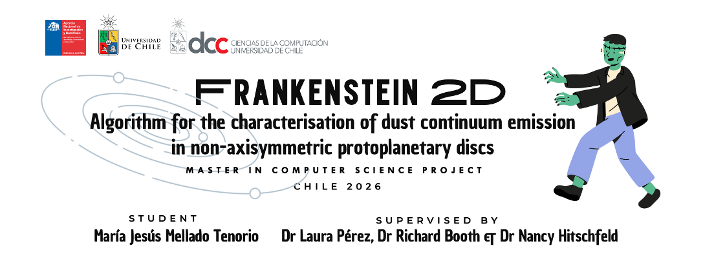

# Frank2D: Non-axisymmetric Visibility Fitting with Gaussian Processes



**Frank2D** is a framework designed to reconstruct high-fidelity images of protoplanetary discs from interferometric visibilities. By extending the Gaussian Process (GP) framework to two dimensions of the frankenstein algorithm (Jennings et al. 2020), this algorithm removes the assumption of azimuthal symmetry, enabling the modeling of complex substructures like spirals and vortices directly in the Fourier plane.


## 🌌 Scientific Context

Protoplanetary discs are structures of gas and dust surrounding young stars. Observations from the **Atacama Large Millimeter/submillimeter Array (ALMA)** in northern Chile provide high-angular-resolution data at (sub)millimetre wavelengths. However, these observations do not yield direct images but rather **visibilities**: an incomplete sampling of data in the Fourier plane.

Reconstructing images from these data is a non-trivial inverse problem. While standard methods like `CLEAN` assume point sources and the original `Frankenstein` algorithm assumes azimuthal symmetry, **Frank2D** leverages Gaussian Processes to model the brightness distribution as a continuous 2D function.

---

## 🚀 Algorithm Pipeline

The Frank2D core handles the computational challenge of high-dimensional matrices ($N^2 \times N^2$) which, for $N \approx 300$, can require up to **130GB of RAM**. To manage this, the algorithm utilizes advanced numerical methods like **Conjugate Gradient Methods** for efficient storage and solution time.

### Flowchart Logic
The algorithm operates as a mediated pipeline:
1.  **Gridding**: Observed visibilities ($V_{obs}$) are sampled into a regular grid ($V_{grid}$).
2.  **MAP Estimation**: Performs a Maximum a Posteriori estimate of hyperparameters to find $\theta_{best}$.
3.  **Gaussian Process**: Models the distribution using the optimized kernel.
4.  **Conjugate Gradient**: Solves the linear system efficiently to obtain model visibilities ($V_{model}$).
5.  **FFT**: Transforms the model visibilities into the final model image ($I_{model}$).


---

## 🛠 Software Architecture

Frank2D is designed using a **Mediator and Strategy pattern**. The central `Frank2D` class acts as a mediator, coordinating independent modules (Gridding, Solver, Plotting) while allowing dynamic switching between hardware strategies.

### Hardware Strategies
* **CPU Strategy**: Optimized for standard workstations and high-compatibility environments.
* **GPU Strategy**: Powered by **CUDA/CuPy**, designed to accelerate the heavy matrix operations useful for high-resolution ($N > 300$) modeling.

---

## 📦 Installation

Frank2D can be installed in a few steps. It is recommended to use a virtual environment.

```bash
# Clone the repository
git clone [https://github.com/mariajmellado/frank2d.git](https://github.com/mariajmellado/frank2d.git)
cd frank2d

# Install with CPU support only
pip install .

# Install with GPU acceleration (requires CUDA)
pip install ".[gpu]"

```
---
## 🧪 Testing

Frank2D includes a comprehensive test suite designed to validate the physical consistency of the algorithm and the performance of the hardware backends (CPU/GPU).

### 1. Prerequisites
You need `pytest` and the `nbmake` plugin to execute both the Python scripts and the Jupyter Notebooks:

```bash
pip install pytest nbmake
```

### 2. How to run?
Execute these commands from the root directory of the project:

Run the full suite (Scripts + Notebooks):
```bash
pytest --nbmake Testing/ -v
```

Run one file test
```bash
python -m pytest Testing/test_file_name.py -v
```